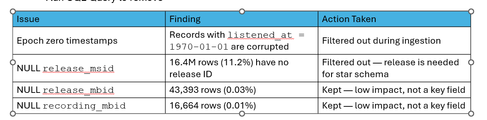

# 🎧 ListenBrainz End-to-End Data Engineering Pipeline | NTU SCTP Module 2

Built a production-grade data pipeline processing 130 million music listening events from the ListenBrainz public dataset — covering the full data engineering lifecycle from raw ingestion to executive dashboard.
What we built:

Ingestion — Direct BigQuery public dataset integration, no data transfer costs
ELT Pipeline — dbt Bronze → Silver → Gold star schema with SCD Type 2 snapshots
Data Quality — 39 automated tests combining dbt core, dbt_utils, and dbt-expectations
Python Analysis — DuckDB + Polars out-of-core processing on 130M rows
Orchestration — Dagster pipeline with weekly automated scheduling
Dashboard — Streamlit app deployed on Google Cloud Run

Key findings delivered to stakeholders:

Identified 31 power users driving disproportionate platform engagement
Radiohead, The Beatles, and Pink Floyd dominate the listen catalogue
Evening (18:00–21:00) accounts for 31% of all platform activity
Regular users represent 52.6% of total listen volume

Tech stack: BigQuery · dbt · Dagster · DuckDB · Polars · Pandas · Streamlit · Cloud Run · Python · SQL

Team 7 — NTU SCTP Data Engineering Programme, Module 2

# Referring to Project Brief
https://console.cloud.google.com/marketplace/product/metabrainz/listenbrainz

## Data Ingestion
Checking data quality during ingestion is considered best practice and also directly supports Step 4 (Data Quality Testing) later.

Basic Data Profiling Checks.
1. Row Count & Sample
2. NULL Checks
3. Duplicate Checks
4. Date Range Check
5. NULL % per Column (Overall Health Score)

=======

## Data Warehouse Design 

### Source data:  
- Use any “ingestion” method to ingest the data. Topic refer to 2.5 

### Step 1:Authenticate GCP by running, a one time set up: "gcloud auth application-default login" @ Terminal
### Step 2:conda activate elt
### Step 3:dbt init listenbrainz_Tables_demo 
### Step 4:Set up profiles.yml
Go to: WSL: /home/<wsl_username>/.dbt/profiles.yml. Copy the austin_bikeshare_demo profile block. Then create a new file listenbrainz_Tables_demo/profiles.yml and paste it in.
### Step 5:Navigate into the project and verify the connection:
- cd listenbrainz_Tables_demo
- dbt debug
### Step 6:Create models/sources.yml
### Step 7:Design and implement your models
- A fact model (models/fact_trips.sql or similar):
- At least one dimension model (models/star/dim_station.sql or similar):
### Step 8: Create snapshots/track_snapshot.sql
### Step 9: Update dbt_project.yml

### Run order when ready
- dbt snapshot --> creates track_snapshot first
- dbt run --> builds all dimension and fact tables
- dbt test --> validates data quality

## ELT Pipeline 

