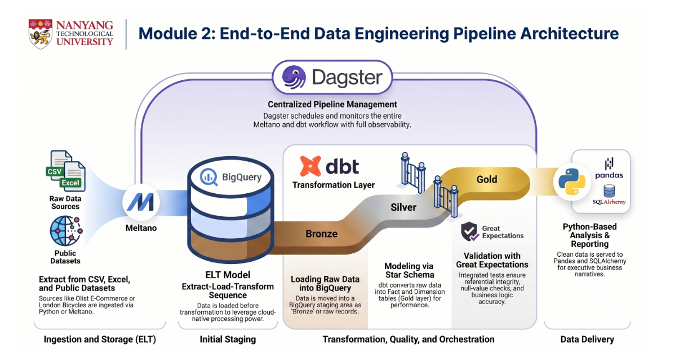

# Referring to Project Brief
https://console.cloud.google.com/marketplace/product/metabrainz/listenbrainz

## Data Warehouse Design 

### Source data:  
- Use any “ingestion” method to ingest the data. Topic refer to 2.5 

### Step 1:Authenticate GCP by running, a one time set up: "gcloud auth application-default login" @ Terminal
### Step 2:conda activate elt
### Step 3:dbt init listenbrainz_Tables_demo 
### Step 4:Set up profiles.yml
Go to: WSL: /home/<wsl_username>/.dbt/profiles.yml. Copy the austin_bikeshare_demo profile block. Then create a new file listenbrainz_Tables_demo/profiles.yml and paste it in.
### Step 5:Navigate into the project and verify the connection:
- cd listenbrainz_Tables_demo
- dbt debug
### Step 6:Create models/sources.yml
### Step 7:Design and implement your models
- A fact model (models/fact_trips.sql or similar):
- At least one dimension model (models/star/dim_station.sql or similar):
### Step 8: Create snapshots/track_snapshot.sql
### Step 9: Update dbt_project.yml

### Run order when ready
- dbt snapshot --> creates track_snapshot first
- dbt run --> builds all dimension and fact tables
- dbt test --> validates data quality

## ELT Pipeline 

